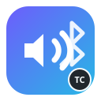

<p align="center">
  
</p>

<h1 align="center">NextSound</h1>

<p align="center">Biến máy tính Ubuntu thành loa Bluetooth A2DP, hỗ trợ SBC, AAC và LDAC.</p>

<p align="center">
  <a href="https://github.com/namnguyenit/NextSound/releases/latest"></a>
  <a href="https://github.com/namnguyenit/NextSound/actions/workflows/ci.yml"></a>
  <a href="LICENSE"></a>
  
</p>

> **Made by TrungCao**

NextSound cung cấp trải nghiệm tương tự Bluetooth Audio Receiver trên Windows: điện thoại đóng vai trò A2DP Source, còn máy tính Linux là A2DP Sink. BlueZ xử lý kết nối Bluetooth; PipeWire/WirePlumber giải mã, định tuyến PCM và phát qua loa, HDMI, USB DAC hoặc tai nghe Bluetooth đang chọn.

## Điểm nổi bật

- Phát hiện điện thoại đã ghép đôi có profile A2DP Audio Source.
- Mở hoặc đóng receiver bằng nút **Phát / Dừng**.
- Chọn riêng codec nhận **SBC, AAC hoặc LDAC** mà không làm mất AAC/SBC-XQ của tai nghe Bluetooth.
- Hiển thị codec, sample rate, số kênh, bitrate và VBR khi BlueZ cung cấp thông tin.
- Điều chỉnh âm lượng riêng của điện thoại từ 0–150%; mức trên 100% là khuếch đại phần mềm.
- Chuyển loa đầu ra ngay cả khi luồng điện thoại đang phát.
- Tự kết nối lại điện thoại sau khi đổi codec và hoàn tác cấu hình nếu WirePlumber lỗi.
- Thương hiệu và credit thống nhất: **Made by TrungCao**.

## Cài đặt nhanh

### Gói phát hành `.deb` — khuyến nghị

Release dựng sẵn hiện hỗ trợ **Ubuntu 22.04 x86_64/amd64**, PipeWire 0.3.48 và WirePlumber 0.4. Gói đã chứa backend PipeWire đã vá, AAC decoder, LDAC decoder và giấy phép đi kèm; APT tự cài các thư viện hệ thống còn lại.

```bash
sudo apt install ./nextsound_0.1.2-1_amd64.deb
systemctl --user daemon-reload
systemctl --user restart wireplumber
```

Sau đó mở **NextSound** từ danh sách ứng dụng hoặc chạy `nextsound`. Tải bản mới nhất tại [GitHub Releases](https://github.com/namnguyenit/NextSound/releases/latest).

> Không cài ép gói amd64 này trên Ubuntu 24.04 hoặc distro dùng ABI PipeWire khác. Trình cài khóa phiên bản tương thích để tránh làm hỏng audio stack.

### Chạy từ mã nguồn

```bash
sudo apt install python3 python3-pip python3-gi python3-dbus \
  gir1.2-gtk-4.0 gir1.2-adw-1 bluez pipewire wireplumber pipewire-pulse
git clone https://github.com/namnguyenit/NextSound.git
cd NextSound
./install.sh
nextsound-doctor
```

Trên Ubuntu 22.04, có thể build lại codec receiver ở cấp user:

```bash
./scripts/install-aac-user.sh
./scripts/install-ldac-user.sh
```

## Cách sử dụng

1. Ghép đôi điện thoại trong **Settings → Bluetooth**.
2. Trên điện thoại, bật quyền **Media audio / Âm thanh phương tiện** cho máy tính.
3. Mở NextSound và chọn loa đầu ra.
4. Chọn codec nhận. SBC tương thích rộng nhất; AAC/LDAC cần điện thoại hỗ trợ.
5. Nhấn **Phát**, sau đó mở nhạc hoặc video trên điện thoại.
6. Kiểm tra dòng **Thực tế** để biết codec đã thương lượng.

## Khả năng tương thích

| Môi trường | Ứng dụng | SBC | AAC receiver | LDAC receiver | Ghi chú |
|---|:---:|:---:|:---:|:---:|---|
| Ubuntu 22.04 amd64 + gói `.deb` | ✅ | ✅ | ✅ | ✅ | Môi trường release được kiểm thử |
| Ubuntu 22.04 từ source | ✅ | ✅ | Cài bằng script | Cài bằng script | Không thay file hệ thống |
| Ubuntu 24.04 / distro khác | Có thể | Phụ thuộc hệ thống | Cần port/build lại | Cần port/build lại | Không dùng binary ABI 0.3.48 |
| ARM64 | Chưa | — | — | — | Chưa có release binary |

Bluetooth codec không chỉ phụ thuộc chip Bluetooth. Codec phải được cả điện thoại, BlueZ, PipeWire plugin và decoder hỗ trợ. Tai nghe `cc pro` dùng AAC và điện thoại dùng LDAC đồng thời đã được kiểm thử trên máy phát triển.

## Kiến trúc

```text
Điện thoại (A2DP Source)
          │  SBC / AAC / LDAC
          ▼
BlueZ (máy tính là A2DP Sink)
          │  MediaTransport1
          ▼
PipeWire + WirePlumber
          │  PCM / routing / volume
          ▼
Loa, HDMI, USB DAC hoặc tai nghe Bluetooth
```

NextSound không tự đọc packet Bluetooth. Ứng dụng điều khiển BlueZ qua D-Bus và PipeWire qua lớp tương thích PulseAudio; codec và luồng PCM vẫn do audio stack Linux quản lý. Xem thêm [tài liệu kiến trúc](docs/architecture.md).

## Kiểm tra và xử lý sự cố

Chạy `nextsound-doctor` để kiểm tra BlueZ, PipeWire, WirePlumber, Audio Sink UUID và decoder AAC/LDAC. Hướng dẫn chi tiết nằm tại [docs/TROUBLESHOOTING.md](docs/TROUBLESHOOTING.md).

## Build gói Debian

```bash
./packaging/build-deb.sh
```

Artifact và checksum được tạo trong `dist/`. CI chạy unit test, kiểm tra shell script và build `.deb` trên Ubuntu 22.04.

## Phạm vi

- Hỗ trợ media stereo A2DP; chưa hỗ trợ cuộc gọi HFP/HSP.
- Độ trễ Bluetooth không phù hợp để monitor nhạc cụ thời gian thực.
- LDAC decoder cộng đồng chưa phải implementation được Sony chứng nhận.
- Gói release không thay thế file do APT quản lý; runtime tùy biến nằm trong `/opt/nextsound`.

## Giấy phép và nguồn bên thứ ba

Mã ứng dụng NextSound phát hành theo [MIT License](LICENSE). Release chứa thành phần PipeWire/SPA, FDK AAC và `libldacdec`; thông báo bản quyền đầy đủ được cài tại `/usr/share/doc/nextsound/third-party/` và lưu trong [`packaging/licenses`](packaging/licenses).

`libldacdec` là decoder cộng đồng reverse-engineered theo giấy phép MIT. Việc sử dụng codec có thể chịu điều kiện bằng sáng chế hoặc pháp lý khác tùy quốc gia và cách phân phối.

## Đóng góp

Xem [CONTRIBUTING.md](CONTRIBUTING.md) trước khi gửi issue hoặc pull request. Không đính kèm log chứa địa chỉ Bluetooth, token, cookie hay dữ liệu nội bộ.

---

<p align="center"><strong>NextSound — Made by TrungCao</strong></p>
